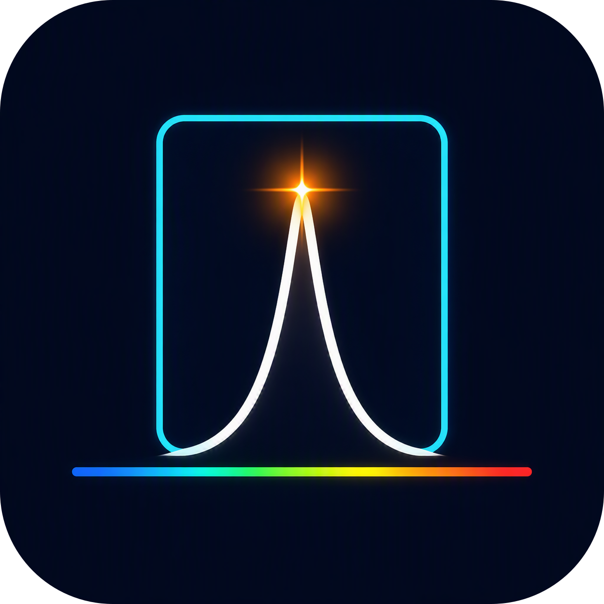
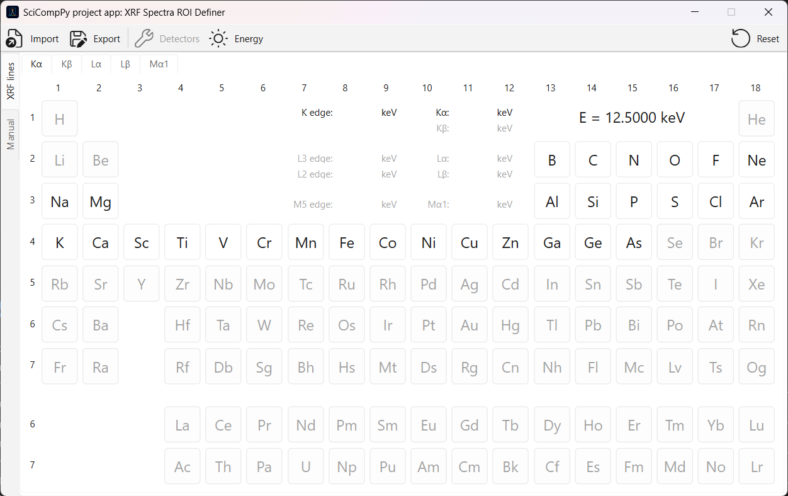
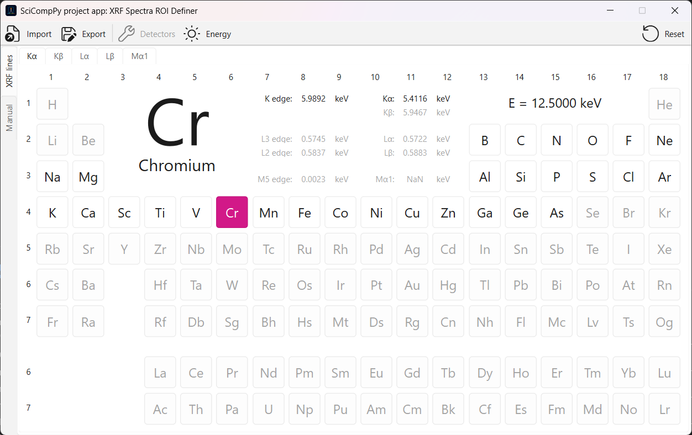
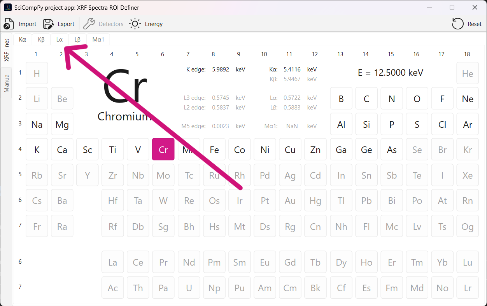
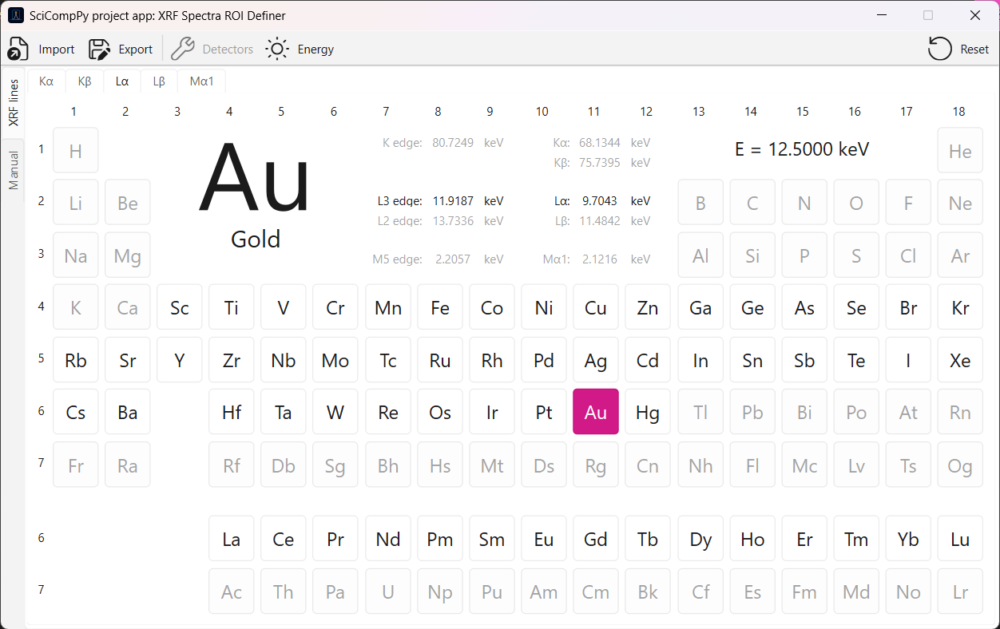
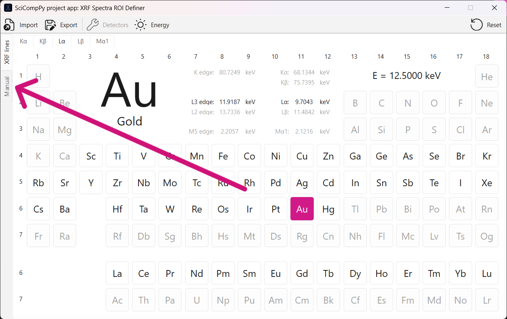
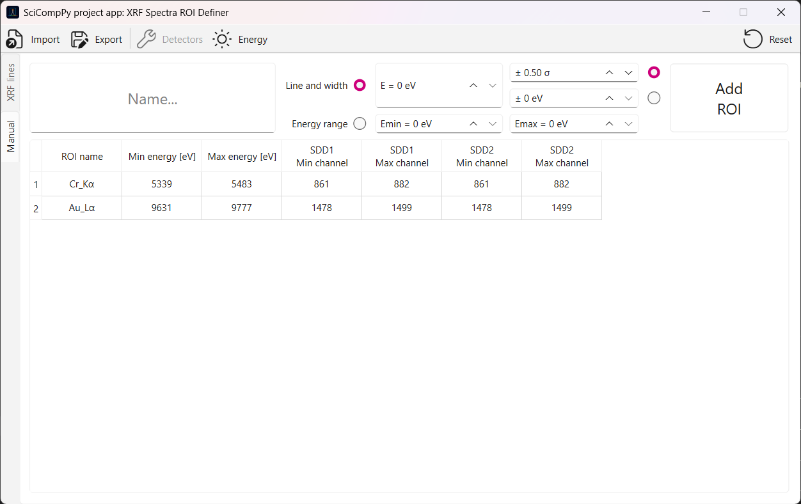
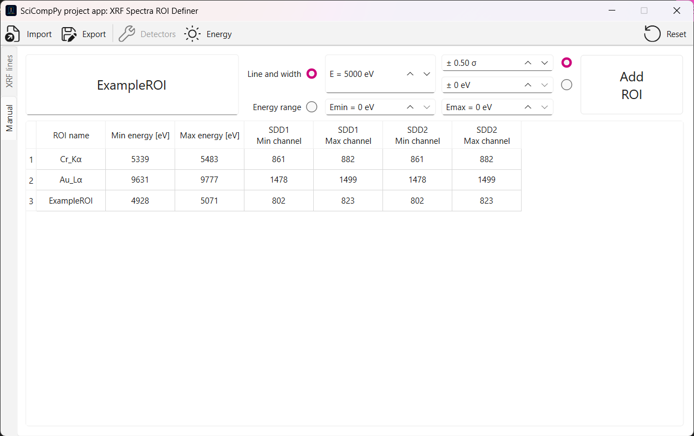
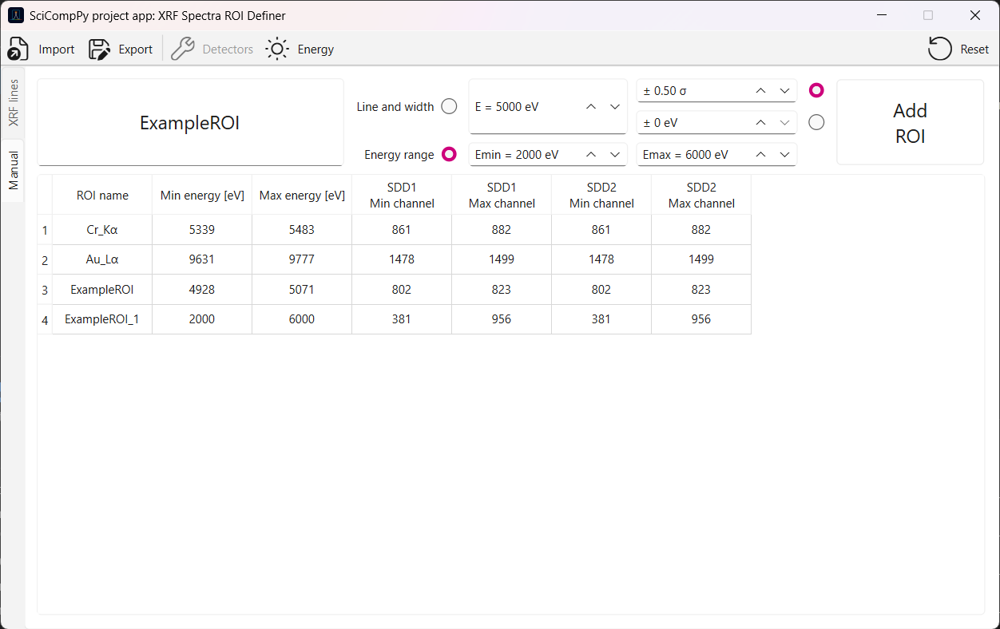

#  XRF Spectra ROI Definer


*SciCompPy project application* for defining energetic regions of interest (ROIs)
for X-ray Fluorescence spectra analysis.

© Filip J. Baran 2026

## Installation and starting

Create virtual enviroment for the application and install libraries with specified below versions:
- python = ">=3.14.3,<3.15",
- xraylib = ">=4.2.1,<5",
- pyside6 = ">=6.11.1,<7".

Download application's files and start by typing `python main.py` with available options:
- `-h, --help` show help message and exit,
- `-e, --energy ENERGY` define excitation energy in eV,
- `-r, --returning {vars,json}` set returning data to console: 'vars' for variables, 'json' for JSON string.

Starting command structure is shown below:
```bash
python main.py [-h] [-e ENERGY] [-r {vars,json}]
```

## Example usage

After starting, for example with specified exciting energy equal to 12500 eV, a window with periodic table opens.



While the mouse is over an element, the information about its name, absorption edges and characteristic lines energies is showing.

For choosing a standard elemental ROI, the corresponding button must be toggled. 



If a button is gray and it don't toggle, it means that the excitation energy is too small for the corresponding element's characteristic line. It can be changed by pressing "Energy" button at the toolbar.

By default, the application is showing a periodic table for Kα characteristic lines, but if other lines are interesting the appropirate table can be opened by choosing a tab:



Then, another standard characteristic line ROI can be choosen.



If the interesting ROI is not standard, it can be defined manually by pressing "Manual" tab:



The already defined ROIs are presented in the table with its name, energy range, and channels range for all defined detectors.



~~The properties of detectors can be changed by pressing "Detectors" button at the toolbar.~~ (it will be implemented in the future)

To define a ROI manualy, the form above the table must be filled with apropriate values, and "Add ROI" button must be pressed. Two modes of energy definition can be choosen:
- energy line in eV and its width defined by:
  - standard deviation calculated by the application (only id detectors are defined),
  - energy in eV.
- energy range in eV.



If the user try to add a ROI with the name that already exists, the application detects it and adds a suffix to the name.



At every moment, defined ROIs can be exported to a JSON file or imported from a JSON file by pressing "Export" or "Import" buttons at the toolbar. For this example the exported file would contain:
```json
{
  "Excitation energy [eV]": 12500,
  "Detectors": {
    "SDD1": {
      "Zero [eV]": -647.684,
      "Gain [eV/channel]": 6.953,
      "Noise [eV]": 140,
      "Fano [-]": 0.006,
      "Epsilon [eV]": 3.85,
      "N [-]": 4096
    },
    "SDD2": {
      "Zero [eV]": -647.684,
      "Gain [eV/channel]": 6.953,
      "Noise [eV]": 140,
      "Fano [-]": 0.006,
      "Epsilon [eV]": 3.85,
      "N [-]": 4096
    }
  },
  "ROIsTable": {
    "Cr_Kα": {
      "Min energy [eV]": "5339",
      "Max energy [eV]": "5483",
      "SDD1 Min channel": "861",
      "SDD1 Max channel": "882",
      "SDD2 Min channel": "861",
      "SDD2 Max channel": "882"
    },
    "Au_Lα": {
      "Min energy [eV]": "9631",
      "Max energy [eV]": "9777",
      "SDD1 Min channel": "1478",
      "SDD1 Max channel": "1499",
      "SDD2 Min channel": "1478",
      "SDD2 Max channel": "1499"
    },
    "ExampleROI": {
      "Min energy [eV]": "4928",
      "Max energy [eV]": "5071",
      "SDD1 Min channel": "802",
      "SDD1 Max channel": "823",
      "SDD2 Min channel": "802",
      "SDD2 Max channel": "823"
    },
    "ExampleROI_1": {
      "Min energy [eV]": "2000",
      "Max energy [eV]": "6000",
      "SDD1 Min channel": "381",
      "SDD1 Max channel": "956",
      "SDD2 Min channel": "381",
      "SDD2 Max channel": "956"
    }
  }
}
```

Additionally, the application can be reseted to the default values and properties by pressing "Reset" button at the toolbar. 

## Default values and calculations

Default detectors properties are presented in a table below:

Name|Zero [eV]|Gain [eV/channel]|Noise [eV]|Fano [-]|Epsilon [eV]|N [-]
---|---:|---:|---:|---:|---:|---: 
SDD1|-647.684|6.953|140|0.006|3.85|4096
SDD2|-647.684|6.953|140|0.006|3.85|4096

Energy line $$E$$ for specified $$\text{channel}$$ is calculated by

$$E=\text{zero}+\text{gain}\cdot\text{channel}$$,

and standard deviation for energy line $$E$$ (characteristic or manually specified energy line, or calculated by equation above) is calculated by

$$\sigma=\sqrt{\text{noise}^2\cdot\text{epsilon}\cdot\text{fano}\cdot E}$$,

where $$\text{zero}, \text{gain}, \text{noise}, \text{fano}$$, and $$\text{epsilon}$$ are properties defined for every detector.